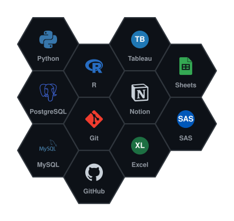

**Data Professional · Analytics · Automation**

</td>
</tr>
</table>

### About Me

I'm a data professional in career transition, based in Brighton. I turn messy datasets into clear stories and better business decisions — currently sharpening my SQL, Python, and R skills while working toward a GitHub Foundations certification.

### 🚀 Featured Projects

<table>
<tr>
<td width="33%" valign="top">

**🧹 GameZone Orders — Data Cleaning & Augmentation**

SQL pipeline that cleans raw order data, derives time-grain columns (year/month/day, time-of-day), and joins in region lookups with full validation checks.

`SQL` `PostgreSQL`

➡️ *Add repo link*

</td>
<td width="33%" valign="top">

**📊 Graduate Outcomes Dashboard**

Interactive analysis exploring graduate earnings using official UK education data.

`R` `ggplot2` `dplyr`

➡️ **Coming Soon**

</td>
<td width="33%" valign="top">

**🤖 SQL Practice Repository**

Real-world SQL interview questions with fully documented, dialect-aware solutions.

`SQL` `PostgreSQL`

➡️ **Coming Soon**

</td>
</tr>
</table>

### 🛠️ Tech Stack

  

### 📈 Activity

<picture>
  <source media="(prefers-color-scheme: dark)" srcset="https://raw.githubusercontent.com/llPriscila/llPriscila/output/github-contribution-grid-snake-dark.svg" />
  <source media="(prefers-color-scheme: light)" srcset="https://raw.githubusercontent.com/llPriscila/llPriscila/output/github-contribution-grid-snake.svg" />
  
</picture>

<em>Just getting started — check back soon 🌱</em>

### 🔗 Connect With Me

 

